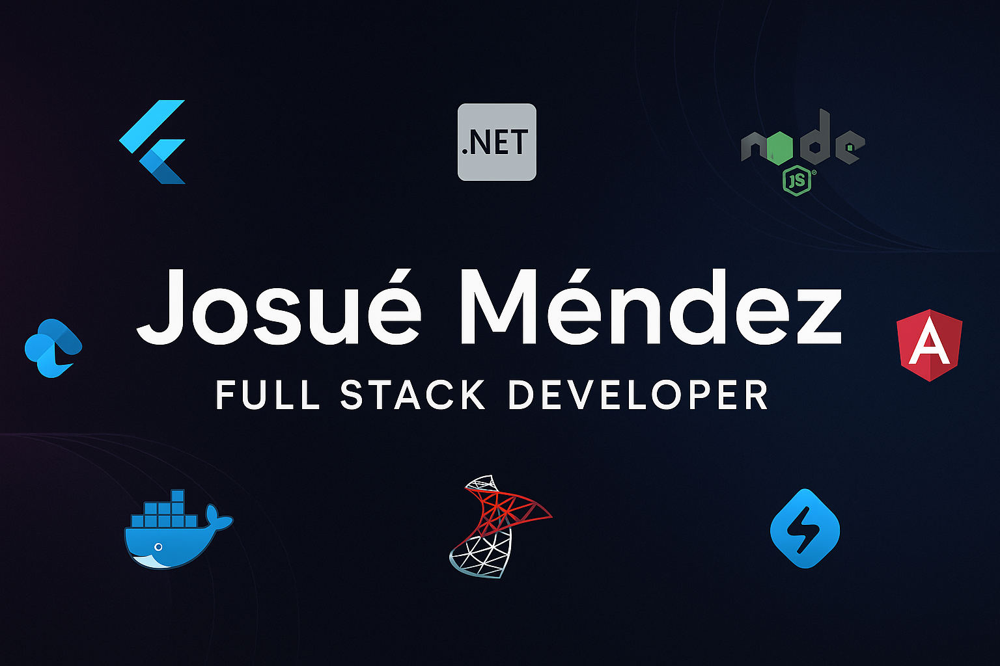

# 👋 ¡Hola! Soy Josué Méndez 🇲🇽

## 🧑‍💻 Full Stack Developer | Líder Técnico | Mobile & Backend Specialist

Soy un desarrollador **Full Stack** con fuerte enfoque en **desarrollo móvil**, **backend**, **web**, y también en **bases de datos** y **DevOps**. Me apasiona crear soluciones escalables, eficientes y adaptadas a las necesidades de cada proyecto. También he tenido la fortuna de liderar equipos de desarrollo y participar en múltiples fases del ciclo de vida de software.

---

## 🚀 Tech Stack

### 👨‍🎨 Frontend

 _(En aprendizaje)_

### 🧱 Backend

### 🗃️ Bases de Datos

### 📱 Mobile

### ☁️ Cloud / DevOps / Infraestructura

 _(Básico)_

### 🧰 Otras herramientas

---

## 📈 Actualmente Aprendiendo:

- React
- NestJS
- Avanzado de SQL Server
- CI/CD con GitHub Actions / DevOps

---

## 📫 Contacto:

- 📧 **Correo:** [josue10718@gmail.com]
- 💼 **LinkedIn:** [www.linkedin.com/in/josue-mendez-83925822b](www.linkedin.com/in/josue-mendez-83925822b)
<!-- - 🌐 **Portfolio:** [www.] (opcional) -->

---

<!-- ## 📊 GitHub Stats

 -->

---

Gracias por visitar mi perfil 😄 ¡Estoy abierto a nuevas oportunidades de colaboración o empleo!
